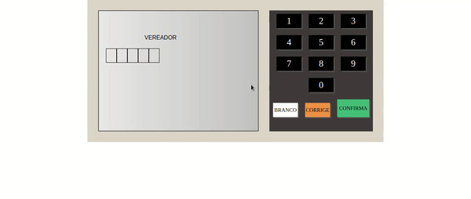

# Urna Eletrônica

## Sobre o projeto:

Este projeto foi elaborado se trata de uma urna eletrônica onde o usuário pode realizar a sua votação de acordo com a escolha para eleição.

## Funcionamento do projeto:

  

## Conceitos tratados:

- Objects;
- Arrays;
- Functions;
- DOM;
